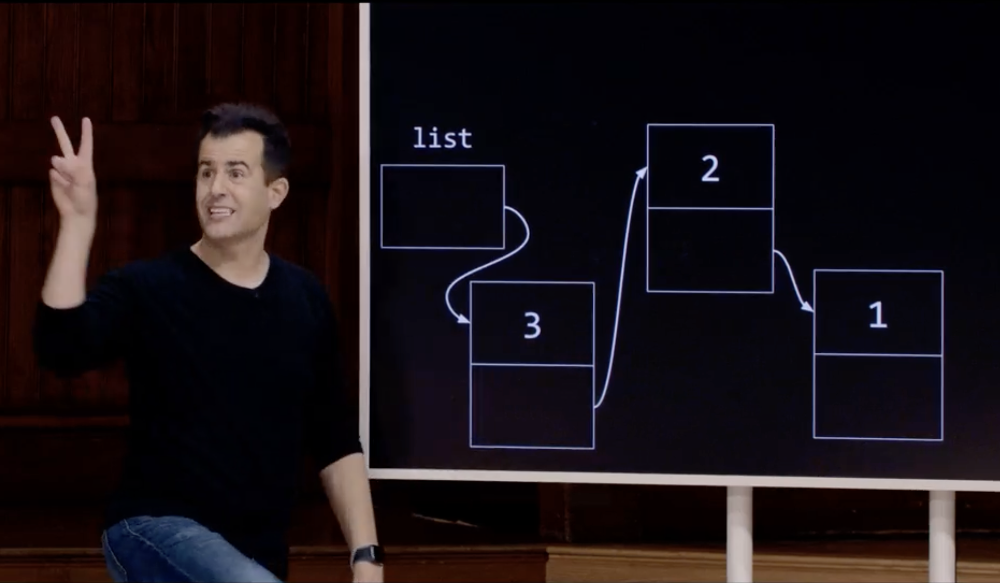
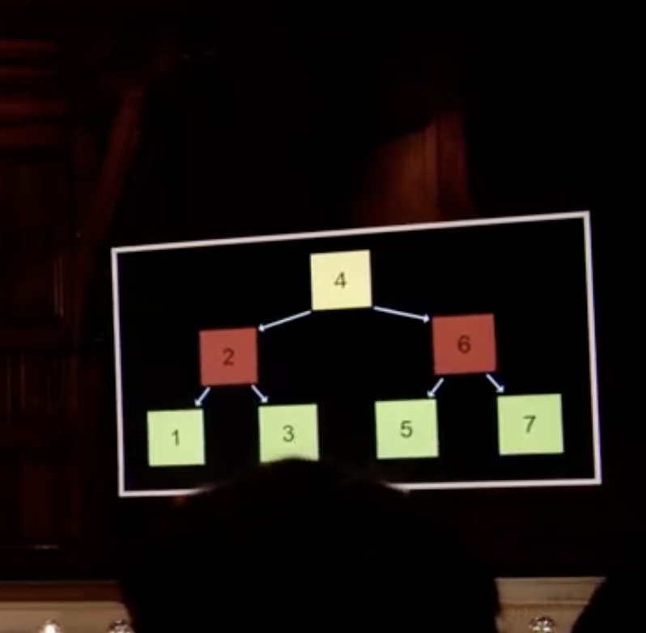
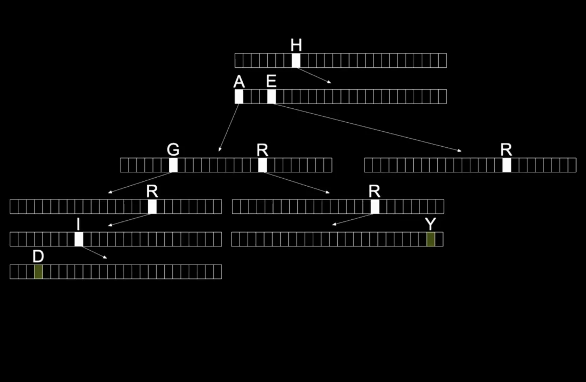
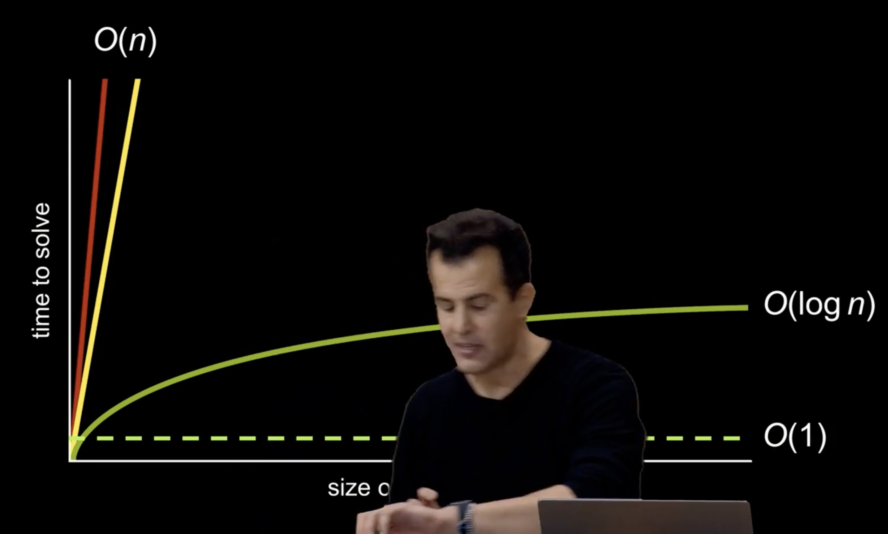
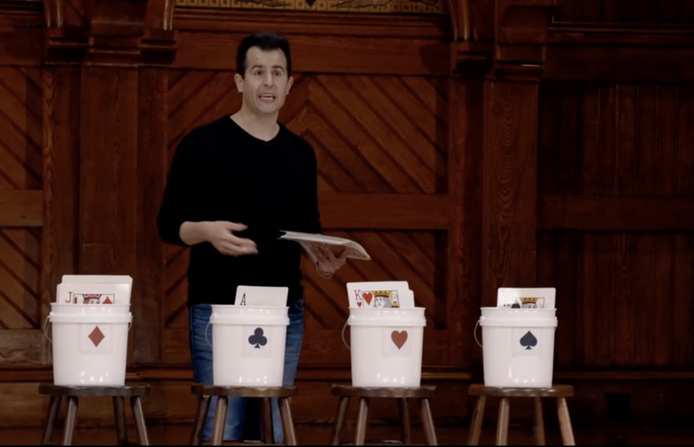
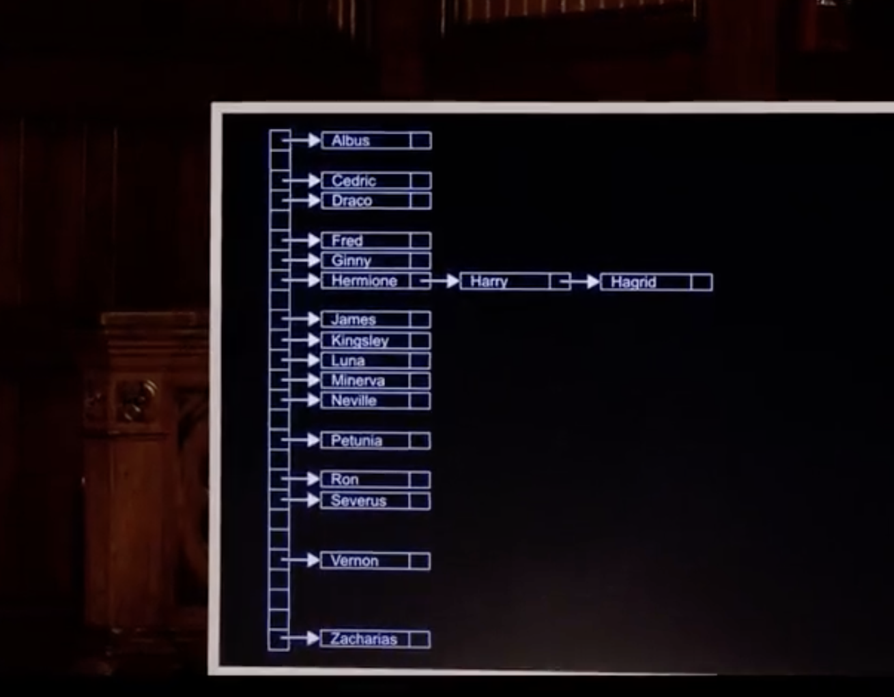

# Data Structures

## Queues

+ Queues are a data structure that allows you to add and remove elements in a FIFO (first in, first out) manner.
+ Enqueueing an element is O(1).
+ Dequeueing an element is O(1).

## Stacks

+ Stacks are a data structure that allows you to add and remove elements in a LIFO (last in, first out) manner.
+ Pushing an element is O(1).
+ Popping an element is O(1).

## Linked Lists

+ Linked lists are a data structure that allows you to add and remove elements in a LIFO (last in, first out) manner.

+ One node pointing to the next node is called a singly linked list.

+ One node pointing to the next node and the previous node is called a doubly linked list.

+ We are using more than double as much memory as with an array (integer 4 + pointer 8 = 12 bytes vs. integer 4 bytes).

+ we can't do binary search on a linked list as there is no physical order to the elements. So, linear time.

### How to build a linked list

+ `node *list = NULL;` //list is a pointer to a node, and it is initialized to NULL

+ vs. `node *list;` // list is a pointer to a node, but it is not initialized, so it has a garbage value in it.

+ `node *n = malloc(sizeof(node));` // n is a pointer to a node, and it is initialized to the address of a node that is the size of a node (`sizeof(node)` figures out the size of our node on its own). `malloc` is a function that allocates memory on the heap. `n`is a temporary variable that we use to point to the node that we just allocated, it stores the address of the node that we just allocated. It still has garbage in it, but it is pointing to the node that we just allocated.

+ `(*n).number = 1;`, or for short `n->number = 1;` // `n` is a pointer to a node, so we can use the `->` operator to access the `number` field of the node that `n` is pointing to. We are setting the `number` field of the node that `n` is pointing to to 1.

+ `(*n).next = NULL;`, or for short `n->next = NULL;` // `n` is a pointer to a node, so we can use the `->` operator to access the `next` field of the node that `n` is pointing to. We are setting the `next` field of the node that `n` is pointing to to NULL.

+ Now, we have our first node. We need to add it to our list.

+ `list = n;` // `list` is a pointer to a node, so we can set it equal to `n`, which is a pointer to a node. We are setting `list` to point to the node that `n` is pointing to.

+ Let's build our second node.

+ `node *n = malloc(sizeof(node));` // Allocate a new node on the heap, and set `n` to point to it.

+ `(*n).number = 2;`, or for short `n->number = 2;`

+ `(*n).next = NULL;`, or for short `n->next = NULL;`

+ Now, we have our second node. We need to add it to our list.

+ `n->next = list;` // Access n, follow the arrow, got to field next and set it equal to list. We are setting the `next` field of the node that `n` is pointing to to point to the node that `list` is pointing to.

+ `list = n;` // We are setting `list` to point to the node that `n` is pointing to. Thus, we have successfully inserted the node. At the beginning of the list.

+ We can do this again and again to add more nodes to the list.

#### Searching

+ O(n) time. (As every search has to start from the beginning of the list and we can't jump to the middle or end of the list.)

#### Inserting

+ Prepending: O(1) time.

+ Appending: O(n) time.

## Trees

### Binary Trees

+ A tree is a two-dimensional data structure.

+ It gives us back the ability to do binary search.

+ It is a recursive data structure because it is defined in terms of itself.

+ A tree is a node that has a value and a list of children.

+ Downside: Memory size.

+ Upside: Speed. O(log n) time.

### Tries

+ A trie is a tree that is used to store strings.

+ Fancier tree, short for retrieval but pronounced "try".

+ It is a tree where each node is an array (including the root node).

+ O(length of string) time.

+ A lot of memory.

## Dictionaries

+ A dictionary is a data structure that allows you to store key-value pairs.

## Time Complexity

+ O(1) is the holy grail of time complexity as it is independent of the size of the input.

## Bucketizing values aka. Hashing

+ Hashing is a way to map a set of values to a set of buckets.

+ Thus, we're reducing a problem of 52 to a problem of 4 (with 13 slots in each bucket).

+ That's a hashtable.

+ Just an array down with linked lists to the right.

+ O(1) till O(n) time complexity.

