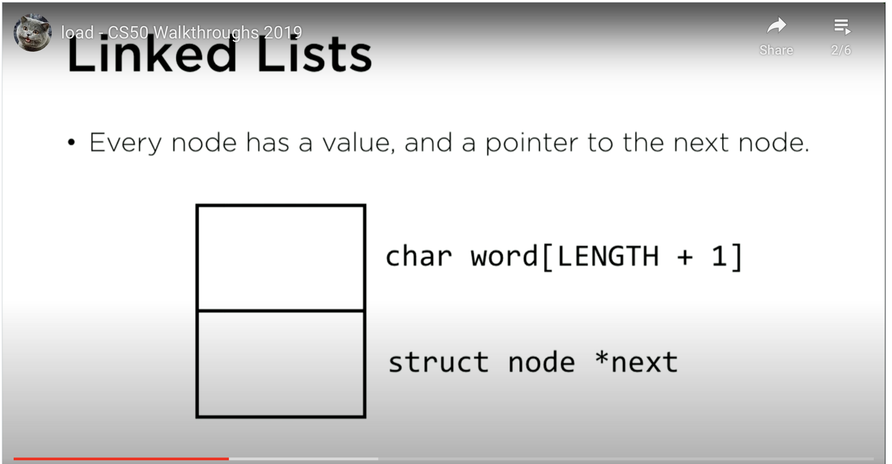

# Notes on Speller

## Hash function

+ A hash function is a function that takes a string and returns a number.

## Hash table

+ A hash table is a data structure that maps keys to values.

+ It is a two-dimensional array.

+ It is a combination of a hash function and an array.

+ Imagine it like a list of buckets. Each bucket represents a linked list.

## Linked list

+ A linked list is a data structure that stores a list of values.

+ It is a recursive data structure because it is defined in terms of itself.

+ It is a list of nodes.

+ Each node has a value (e.g. a word) and a pointer to the next node (that gives us the address of the next node).
+ It is a linear data structure because it is ordered.

+ It is a dynamic data structure because it can grow and shrink.

+ It is a flexible data structure because it can be used to implement other data structures.

+ It is a good data structure for implementing stacks and queues.

+ It is a good data structure for implementing hash tables.

+ It is a good data structure for implementing graphs.

+ It is a good data structure for implementing trees.

